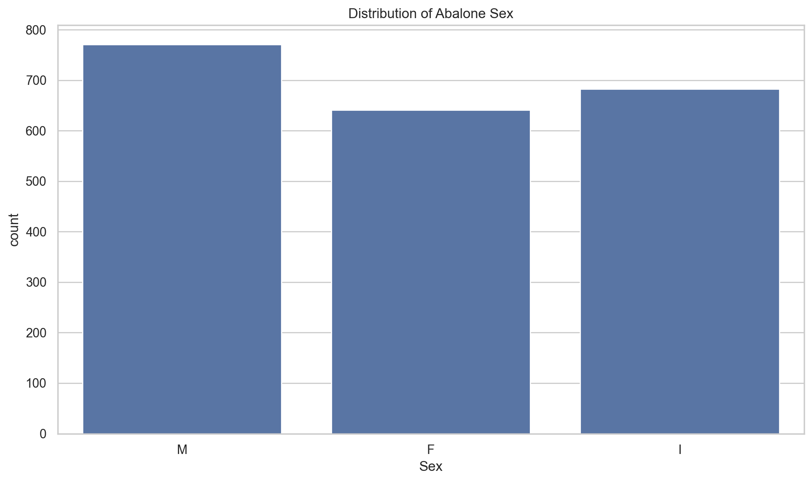
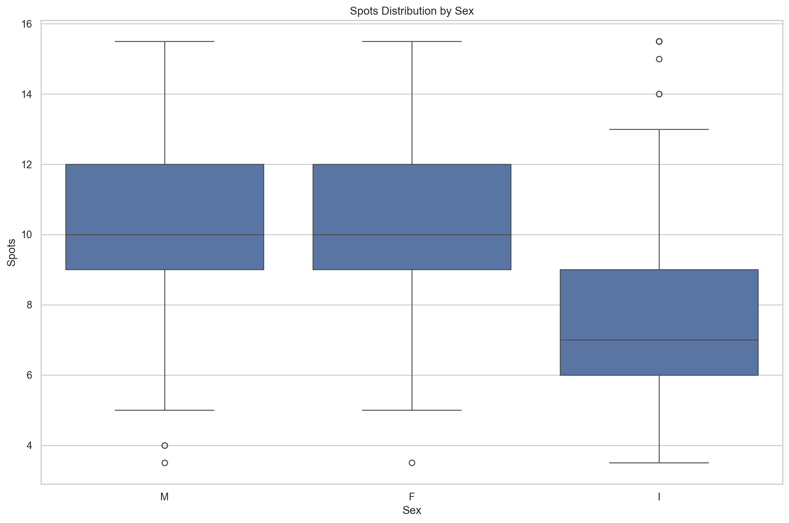
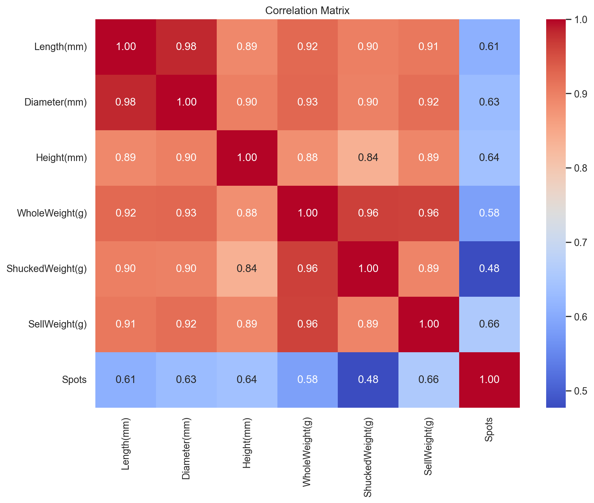
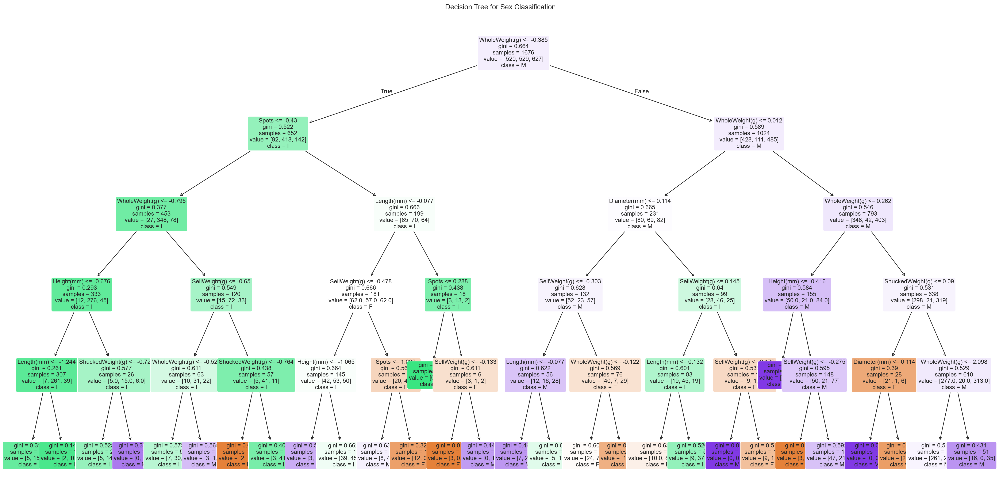

# Abalone Health Analysis

This project explores an Abalone dataset with a practical machine learning workflow built around data cleaning, exploratory analysis, regression, classification, and clustering.

The main script is `abalone_health.py`, and the notebook version of the analysis is available in `abalone_health_analysis.ipynb`.

## Project Files

- `abalone_health.py`: Python script that runs the full analysis
- `abalone_health_analysis.ipynb`: notebook version with executed outputs and charts
- `Abalone Data Set [2874].xlsx`: source dataset
- `images/`: generated visual outputs used by both the notebook and this README

## Analysis Workflow

1. Load the Excel dataset and inspect data types and missing values.
2. Fill missing numeric values with the median.
3. Remove invalid `Sex` values outside `M`, `F`, and `I`.
4. Cap numeric outliers with the IQR method.
5. Explore the cleaned dataset with visualisations.
6. Predict `Spots` using LASSO regression for each sex group.
7. Predict `Sex` using a decision tree and logistic regression.
8. Compare K-Means clusters against the original sex labels.

## Key Findings

- The dataset starts with `2,097` rows and `8` columns.
- There are a few missing values across the numeric measurement columns.
- Two invalid `Sex` values are removed during cleaning.
- `SellWeight(g)` is the strongest positive predictor of `Spots` across the LASSO models.
- Regression performance is moderate:
  - `M`: `R2 = 0.4611`
  - `F`: `R2 = 0.2451`
  - `I`: `R2 = 0.4486`
- Classification performance is also moderate, with both models reaching around `55%` accuracy.
- The unsupervised clustering shows one cluster strongly associated with class `I`, while classes `F` and `M` overlap more heavily.

## Generated Visuals

### Sex Distribution



### Spots By Sex



### Correlation Matrix



### Decision Tree



## How To Run

Create and use a virtual environment, then install the required packages:

```bash
python -m venv .venv
.venv\Scripts\activate
pip install -r requirements.txt
```

Run the script:

```bash
python abalone_health.py
```

Open the notebook:

```bash
jupyter notebook abalone_health_analysis.ipynb
```

## Notes

- The charts are saved to `images/`.
- The notebook already includes executed outputs so it is ready to review.
- The workflow is suitable for a portfolio project because it shows end-to-end analysis rather than only one model type.
